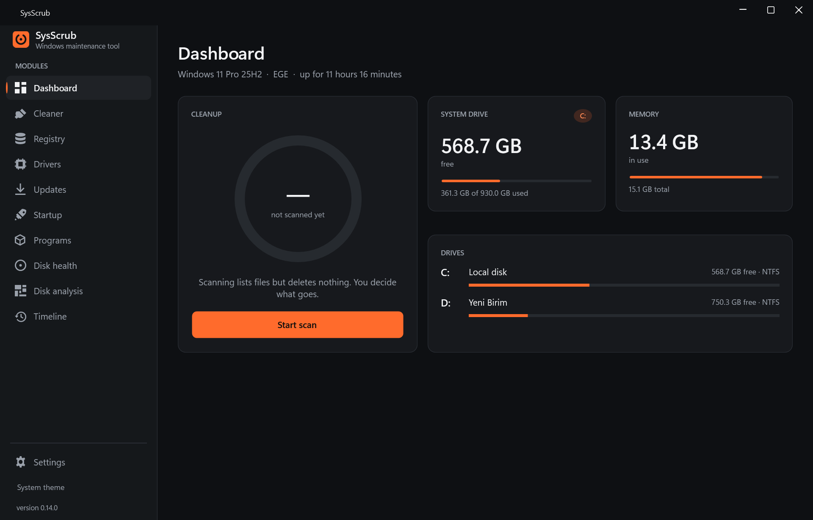
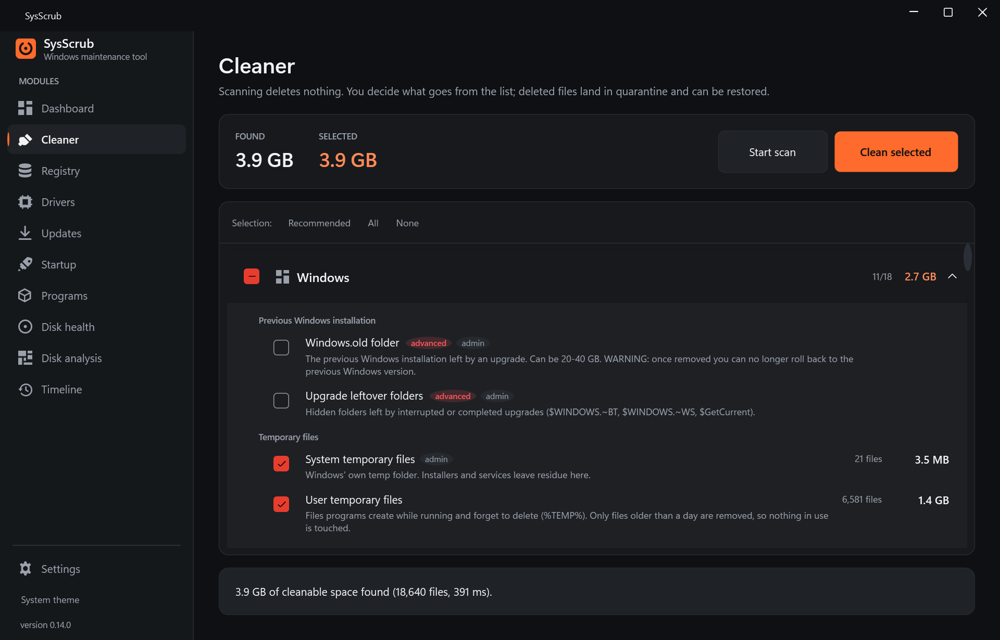
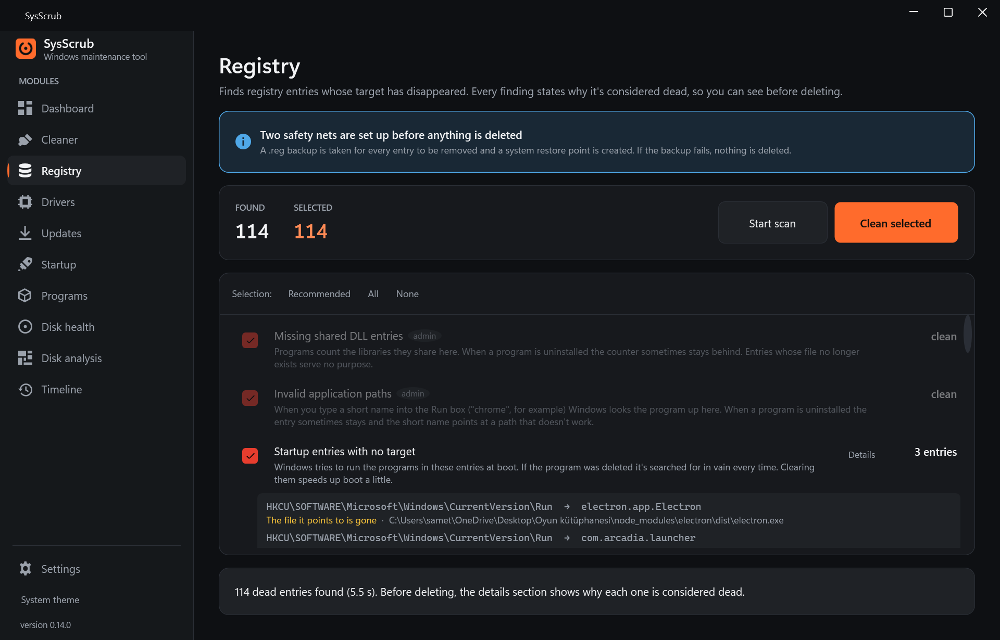
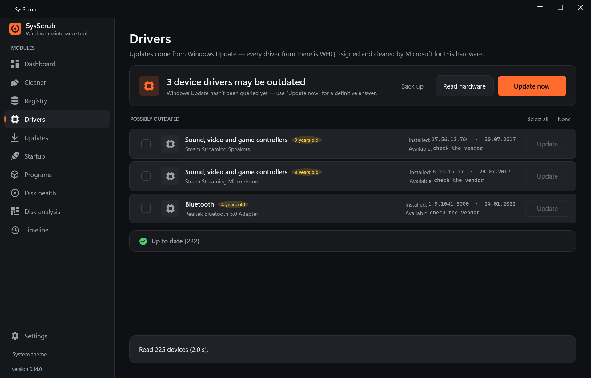
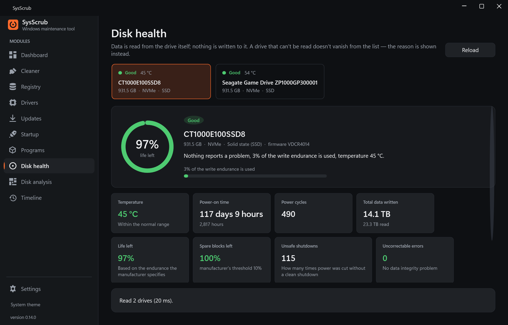
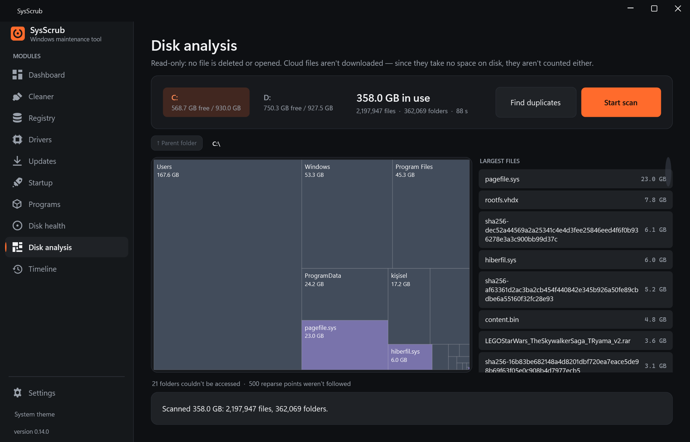
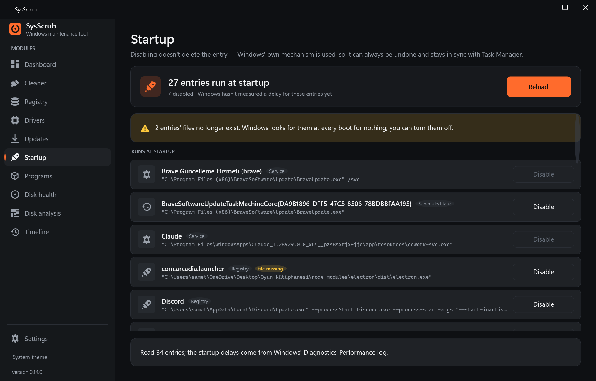
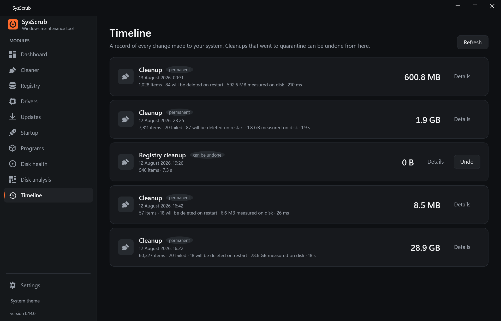

<div align="center">


**Windows のメンテナンス、ドライバー更新、ドライブの健康状態 — ひとつのアプリで。**

[](https://github.com/SametEge/SysScrub/releases/latest)
[](LICENSE)
[](https://github.com/SametEge/SysScrub/actions/workflows/ci.yml)

### [⬇ 最新リリースをダウンロード](https://github.com/SametEge/SysScrub/releases/latest)

[English](README.md) · [Türkçe](README.tr.md) · [Deutsch](README.de.md) · [한국어](README.ko.md) · [简体中文](README.zh-Hans.md)

</div>

---



## 何ができるか

3 つの別々のプログラムぶんの仕事を、きちんと設計されたひとつの画面にまとめました。

| | |
|---|---|
| 🧹 **クリーンアップ** | Windows、ブラウザー、アプリの残骸をルールに沿って調べます。削除したものはすべて検疫フォルダーに入り、ワンクリックで戻せます。 |
| 🗂 **レジストリ** | 参照先が消えた項目を探す 12 のスキャナー。何かを削除する前に `.reg` バックアップと復元ポイントを作成します。 |
| ⚙️ **ドライバー** | ハードウェアを識別し、古いドライバーを見つけます。更新は Windows Update から — WHQL 署名済みで、Microsoft がそのハードウェア向けに承認したものです。 |
| 📥 **更新** | winget を通じてインストール済みプログラムの新しいバージョンを探します。各パッケージは発行元自身のソースから取得されます。 |
| 🚀 **スタートアップ** | 起動時に動くものすべてをひとつの一覧に。無効化には Windows 自身の仕組みを使うので、タスク マネージャーと食い違いません。 |
| 📦 **プログラム** | まとめてアンインストール。結果は登録が実際に消えたかどうかで確認します — 終了コードは当てになりません。 |
| 💽 **ドライブの健康状態** | S.M.A.R.T. と NVMe のヘルス データを読み取ります: 温度、通電時間、総書き込み量、残り寿命。生の値の横に、それが何を意味するかも示します。 |
| 📊 **ストレージ分析** | 容量を食っているのは何か。ツリーマップ表示、最大サイズのファイル、3 段階の重複ファイル検出。 |
| 🕓 **タイムライン** | アプリがシステムに加えたすべての変更を、時系列の記録としてひとつに。どの時点からでも元に戻せます。 |

## なぜもうひとつクリーナーを作るのか

既存のものはどれかしら苛立たせることをします。水増しされた「削減できた容量」の数字、取り消せない
削除、肥大化したバックグラウンド サービス、有料の壁、テレメトリ。

SysScrub の立場はこうです。

- **スキャンは決して削除しません。** どのモジュールもまず読み取り、何を見つけたかとその理由を示し、
  待ちます。何を消すかを決めるのはあなたです。
- **取り消せないものはありません。** クリーンアップ、レジストリ、ドライバー、スタートアップ —
  すべての変更はひとつのタイムラインに残り、そこから巻き戻せます。
- **数字は本物です。** 取り戻した容量は前後にドライブ上で実測し、推定しません。「システムが 40%
  速くなりました」のような作り話はありません。
- **わからないときは、わからないと言います。** S.M.A.R.T. を読み取れないドライブは一覧から消えず、
  緑のバッジも付きません — 読み取れなかった理由を示します。
- **アカウントなし、広告なし、テレメトリなし、有料版なし。**

---

## モジュール

### クリーンアップ



Windows、ブラウザー、アプリ、ゲーム プラットフォーム、開発ツール、プライバシーの痕跡にわたる
48 のルール。それぞれが何を削除し、その結果どうなるかを明記します — 気まずい部分も含めて
(「Windows.old を削除すると、以前の Windows バージョンには戻せなくなります」)。

ルールは**コードではなくデータ**です。[`data/rules/*.json`](data/rules) にあります。新しい削除対象を
加えるのは JSON を書き足すことであって、プログラムを変えることではありません。

1 つのファイルが削除される前に、安全確認を通ります。保護された Windows のディレクトリ、あなたの
ドキュメント、再解析ポイント (ジャンクションやシンボリック リンクは決してたどりません)、クラウドの
プレースホルダー ファイルは拒否されます。単なる一時フォルダー以外のものは、まず検疫に入ります。

### レジストリ



12 のスキャナー: 共有 DLL のカウンター、ファイルの関連付け、ProgID と CLSID の項目、COM サーバー、
タイプ ライブラリ、シェル拡張、アンインストール項目、アプリケーション パス、スタートアップ項目、
MUICache、インストーラー フォルダー、サウンド イベント。

見つかった項目はすべて、完全なキーのパス**と、なぜ無効と判断したか**を示します。削除の前に、影響を
受けるすべてのキーの `.reg` エクスポートを書き出し、加えてシステムの復元ポイントを作成します。
バックアップに失敗した場合、何も削除されません。

Windows の動作に必要なキー — サービス、DriverStore、WinSxS、コンポーネント サービス、.NET、
Defender — はコードに埋め込まれた「触れない」一覧に入っています。

### ドライバー



SetupAPI によるハードウェア インベントリと、更新元としての Windows Update。一覧は 2 つの正直な区分に
分かれます。Windows Update が実際に新しいバージョンを提供しているドライバーと、2 年以上前のもので
どの提供元も更新を出していないドライバーです。後者は「古い可能性あり」と表示します —「古い」とは
言いません。わからないからです。

何かをインストールする前に、サード パーティのドライバーをすべてワンクリックでバックアップ
フォルダーへ書き出せます。

### ドライブの健康状態



NVMe ヘルス ログ (ページ 0x02) と ATA S.M.A.R.T. をドライブから直接読み取ります。温度、通電時間、
電源投入回数、総書き込み量、残り寿命、予備ブロック、安全でない電源断、訂正不能エラー — それぞれの
横に平易な言葉での読み方を添えて。

ベンダー固有の属性の意味は [`data/smart-attributes.json`](data/smart-attributes.json) にあるため、
新しいメーカーへの対応は表に 1 行足すことであって、コードの変更ではありません。

### ストレージ分析



ドライブ全体の squarified ツリーマップ、最大サイズのファイル、ファイル種別の内訳。読み取り専用で、
ファイルを削除することも、開くことすらありません。クラウド ファイルはダウンロードしません —
ディスク上で容量を使っていないので、集計にも入れません。読み取れなかったフォルダーは黙って飛ばさず、
数えて報告します。

重複ファイル検出は 3 段階で比較します — サイズ、次に先頭と末尾の 4 KB、最後に完全な SHA-256 —
必要な分だけをハッシュします。

### スタートアップとプログラム



Run と RunOnce のキー (両方のレジストリ ビュー)、スタートアップ フォルダー、ログオンをトリガーとする
タスク、Microsoft 以外の自動開始サービス。無効化はタスク マネージャーと同じ `StartupApproved` に
書き込むので、両者が食い違うことはありません。起動の遅延は推測ではなく、Windows の
Diagnostics-Performance イベント ログから読み取った実測値です。

アンインストールは各プログラム自身のアンインストーラーを実行し、その結果をレジストリの登録が実際に
消えたかどうかで確認します。

### タイムライン



実行のたびに記録されます: 何を削除したか、何バイトか、どのルールか、元に戻せるかどうか。検疫された
クリーンアップはワンクリックで復元できます。

---

## インストール

**インストーラー:** [Releases](https://github.com/SametEge/SysScrub/releases/latest) から
`SysScrub-Setup-*.exe` を入手して実行してください。

**ポータブル:** `SysScrub-*-portable-x64.zip` を展開して実行するだけで、インストールは不要です。
実行ファイルの隣に空の `portable.flag` を置くと、アプリは設定とログをすべて自分のフォルダーに保存し、
システムには何も書き込みません (USB メモリーから使うときに便利です)。

> **SmartScreen の警告:** コード署名証明書で署名していないため、Windows が「発行元不明」の警告を
> 表示します。*詳細情報 → 実行* を選んでください。自分でビルドしたい場合のために、ソースはすべて
> ここにあります。

**動作条件:** Windows 10 1809 以降 (64 ビット)。.NET 8 デスクトップ ランタイムが無ければ
インストーラーが取得を提案します。self-contained のポータブル版に前提条件はありません。

アプリは管理者権限で動作します — Windows Update のキャッシュ、サービスの停止、S.M.A.R.T. の読み取りは
そうでなければできません。

**更新**はこのリポジトリのリリースに対して 1 日 1 回確認され、設定画面からインストールできます。
ダウンロードしたパッケージは、リリースとともに公開された `SHA256SUMS.txt` と照合されます。ハッシュが
一致しなければファイルは削除され、何も実行されません。この確認はバージョン番号を読むだけで何も送信
しません — 無効にもできます。

## 言語

インターフェイスは**トルコ語、英語、ドイツ語、日本語、韓国語、簡体中国語**で提供され、48 個の
クリーンアップ ルールの説明も含みます。初回起動時に Windows の設定から言語が選ばれ、いつでも変更でき、
再起動なしですぐに反映されます。

カタログは [`data/i18n/`](data/i18n) にある素の JSON です — ある言語に貢献するには、ファイルを 1 つ
送るだけです。ドイツ語、日本語、韓国語、中国語の翻訳はネイティブによる確認を待っています。

## 状況

現在 `0.14.0-alpha` で、活発に開発中です。9 つのモジュールが動作し、実際のシステム データを読み取って
います。まだ足りないものは [docs/ROADMAP.md](docs/ROADMAP.md) に正直に並べてあります。

| 完了 | まだ |
|---|---|
| クリーンアップ · レジストリ · ドライバー · ソフトウェア更新 | バックグラウンド動作と通知領域 |
| スタートアップ · プログラム · ドライブの健康状態 · ストレージ分析 | コマンド パレット (Ctrl+K) |
| タイムライン · 6 言語 · 自動更新 | Windows Update 以外のドライバー入手元 |

## ソースからビルドする

```powershell
git clone https://github.com/SametEge/SysScrub.git
cd SysScrub
dotnet build
dotnet run --project src/SysScrub.App
```

`dist/` とインストーラーを作るには:

```powershell
./build/publish.ps1 -SelfContained
```

インストーラーの手順には [Inno Setup 6](https://jrsoftware.org/isdl.php) が必要です
(`winget install JRSoftware.InnoSetup`)。無い場合その手順は飛ばされ、ポータブル版の出力は作られます。

## 構成

```
src/SysScrub.Core    エンジン — スキャン、安全確認、ドライバーとディスクの層。UI 依存なし
src/SysScrub.App     WPF のインターフェイス、デザイン システム、多言語化
src/SysScrub.Cli     スケジュール実行・サイレント クリーンアップと技術者向けレポート
tests/               496 個のテスト: 安全確認、ルール エンジン、S.M.A.R.T. 解析、カタログ
data/rules           クリーンアップ ルール (JSON)
data/i18n            インターフェイスの翻訳 (JSON)
build/               リリース用スクリプトとバージョン番号
installer/           Inno Setup スクリプトとウィザードの画像
```

## 参加する

バグ報告と提案は [issue](https://github.com/SametEge/SysScrub/issues) でお待ちしています。

2 つのことは C# をまったく必要としません。

- **クリーンアップ ルール** — [`data/rules/`](data/rules) に JSON を追加する
- **翻訳** — [`data/i18n/`](data/i18n) のファイルを 1 つ編集する

## ライセンス

[MIT](LICENSE) · サード パーティの表示は [THIRD-PARTY-NOTICES.md](THIRD-PARTY-NOTICES.md) に
